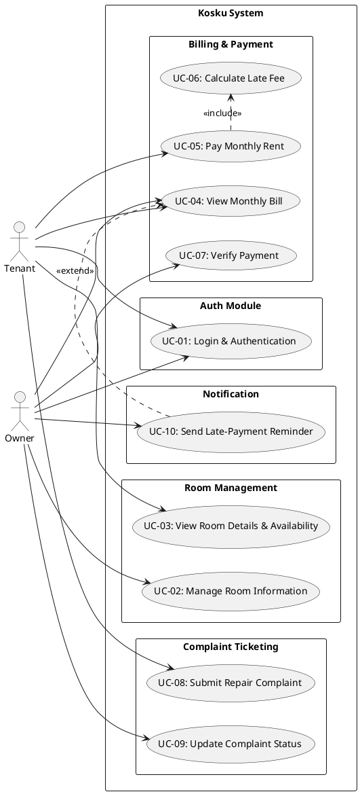

```plantuml
@startuml
left to right direction
skinparam packageStyle rectangle

actor "Tenant" as tenant
actor "Owner" as owner

rectangle "Kosku System" {

  package "Auth Module" {
    usecase "UC-01: Login & Authentication" as UC1
  }

  package "Room Management" {
    usecase "UC-02: Manage Room Information" as UC2
    usecase "UC-03: View Room Details & Availability" as UC3
  }

  package "Billing & Payment" {
    usecase "UC-04: View Monthly Bill" as UC4
    usecase "UC-05: Pay Monthly Rent" as UC5
    usecase "UC-06: Calculate Late Fee" as UC6
    usecase "UC-07: Verify Payment" as UC7
  }

  package "Complaint Ticketing" {
    usecase "UC-08: Submit Repair Complaint" as UC8
    usecase "UC-09: Update Complaint Status" as UC9
  }

  package "Notification" {
    usecase "UC-10: Send Late-Payment Reminder" as UC10
  }
}

tenant --> UC1
tenant --> UC3
tenant --> UC4
tenant --> UC5
tenant --> UC8

owner --> UC1
owner --> UC2
owner --> UC4
owner --> UC7
owner --> UC9
owner --> UC10

UC5 .> UC6 : <<include>>
UC10 .> UC4 : <<extend>>

@enduml
```
